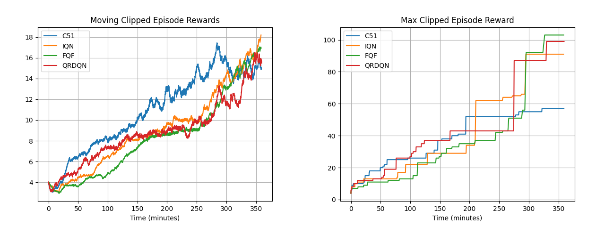

[](https://makeapullrequest.com) 
# Distributional-RL
This repository is a comprehensive implementation of the state-of-the-art Deep Distributional Reinforcement Learning Algorithms that have been introduced as a series of improvements upon each other and are mainly focused on the Atari benchmark.  

Included algorithms **via a single API**:
- C51 (Categorical DQN)
- IQN (Implicit Quantile Networks)
- QRDQN (Quantile Regression DQN)
- FQF (Fully parameterized Quantile Function)

## Demo
> IQN Agent:
<p align="center">
  
</p>  

## Results
> Environment: AssaultNoFrameskip-v4
<p align="center">
  
</p>  

- As it's been highlighted in the part 4 of the FQF paper, FQF algorithm is roughly 20% slower (in terms of runtime speed) than other methods thus, to have a comparable baseline of each method's performance against others, I have plotted the performance metrics with respect to the processing time rather than steps taken by the agent in the environment.
- The runtime was bounded to 6 hours available for free-gpu-equipped machines in the [paperspace.com](https://paperspace.com/) as the host of running the current code.

## Dependencies
- gym == 0.19.0
- numpy == 1.22.0
- opencv_python == 4.5.5.62
- psutil == 5.8.0
- torch == 1.10.2
- wandb == 0.12.9

## Usage
```bash
python main.py --agent_name="FQF" --online_wandb --interval=100 --mem_size=850000 --env_name="BreakoutNoFrameskip-v4"
```
```bash
usage: Choose your desired parameters [-h] [--agent_name AGENT_NAME]
                                      [--env_name ENV_NAME]
                                      [--mem_size MEM_SIZE] [--seed SEED]
                                      [--interval INTERVAL] [--do_test]
                                      [--online_wandb]

optional arguments:
  -h, --help            show this help message and exit
  --agent_name AGENT_NAME
                        Distributional method name
  --env_name ENV_NAME   Name of the environment.
  --mem_size MEM_SIZE   The memory size.
  --seed SEED           The random seed.
  --interval INTERVAL   The interval specifies how often different parameters
                        should be saved and printed, counted by the number of
                        episodes.
  --do_test             The flag determines whether to train the agent or play
                        with it.
  --online_wandb        Run wandb in online mode.
```
###  Considerations
- Accepted values for `agent_name`: {`"C51"`,` "IQN"`, `"FQF"` and `"QRDQN"`}.
- At the time of testing, the code by default uses the weights of the latest run available in _`weights`_ folder so, please bear in mind to put your desired weights in the appropriate folder inside the _`weights`_ directory! 👇
> common/logger.py:
```python
def load_weights(self):
    model_dir = glob.glob("weights/*")
    model_dir.sort()
    # model_dir[-1] -> means latest run!
    checkpoint = torch.load(model_dir[-1] + "/params.pth")
    self.log_dir = model_dir[-1].split(os.sep)[-1]
    return checkpoint
```

## References
1. [_A Distributional Perspective on Reinforcement Learning_, Bellemare, et al., 2017](https://arxiv.org/abs/1707.06887)
2. [_Implicit Quantile Networks for Distributional Reinforcement Learning_, Dabney et al., 2018](https://arxiv.org/abs/1806.06923)
3. [_Distributional Reinforcement Learning with Quantile Regression_, Dabney et al., 2017](https://arxiv.org/abs/1710.10044)
4. [_Fully Parameterized Quantile Function for Distributional Reinforcement Learning_, Yang et al., 2019](https://arxiv.org/abs/1911.02140)
5. [_Distributional Reinforcement Learning (draft)_, Bellemare et al., 2022](https://www.distributional-rl.org/)

## Acknowledgement
Following repositories were great guides to implement distributional rl ideas. Big thanks to them for their work:
1. [DeepRL_PyTorch](https://github.com/Kchu/DeepRL_PyTorch) by [@Kchu](https://github.com/Kchu)
2. [FQF](https://github.com/microsoft/FQF) by [@microsoft](https://github.com/microsoft)
3. [fqf-iqn-qrdqn.pytorch](https://github.com/ku2482/fqf-iqn-qrdqn.pytorch) by [@ku2482](https://github.com/ku2482)
